# PIC LIGHTBLUE EXPLORER DEMO

---

Devices (Device): \| **PIC16LF18456(MCU)** \| **RN4870(BLE)** \| **MCP9844** \| **BMA253** \|
Devices (Unused, On-Board): \| **ECC608(Crypto)** \| **SST25PF040CT** \| **CLICK Header** \|
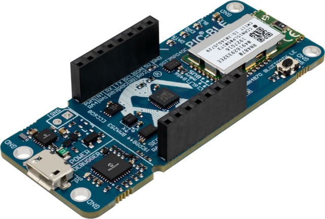

### Hardware Pinout
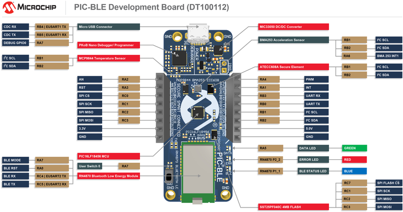

---

## Demonstration Features
1. Bridged Communication between CDC <--> RN Module when in DISCONNECTED state
    - Allow for direct execution of commands of RN487X Module
    - Refer to [RN487X User Guide](http://ww1.microchip.com/downloads/en/DeviceDoc/50002466B.pdf) for details of use. 
2. There are No Application behaviors when NOT CONNECTED outside the Bridge communication feature.
3. Use the LightBlue(tm) by Punch Through for BLE demonstration. 
    - Application is supported by iOS & Android Cell Phone devices.
    - Available in the Application Store
4.  Demonstration uses character profile configured to allow for format specification with the phone application
    - Microchip Logo & Name will appear for BLE devices containing the names:
        * PIC-BLE
        * AVR-BLE
        * RN487X
5. When CONNECTED(ING) to the application the BLUE LED (BLE) will turn on.
    - The LED will BLINK during the interrogation process.
    - Interrogation process is very fast, BLINKING may not be observable
6. From the Phone Application the following actions can be performed.
    - LEDs State toggled based upon toggle switches. (Top Left)
    - Push Button status is shown. (Top Right)
    - Accelerometer X, Y, Z data is visible via horizonal scroll bars. (Middle)
    - Strings Typed into the CDC Terminal while CONNECT are displayed on the screen. (Middle Bottom
        * Shown in ASCII
        * Shown in Hex
    - Data can be written into the Terminal and sent to the End-Device.
        * Sent in ASCII (String) form
        * Sent in Hex (base 16) form
6. The application will display Data sent from the LightBlue Explorer Demo every ~1 Second.
    - Data is sent as 'Characters', & displayed in varied form.
        * Temperature value: Sent as (int16_t) hex Celsius value - Displayed Celsius or Fahrenheit
        * Accelerometer value: Sent as (int16_t) hex 12-bit values - Displayed + / - (X, Y, Z)
        * Push Button State: Sent as (uint8_t) hex boolean value represented per button - 0 / 1 (NOT PUSHED / PUSHED)
        * LEDs Status: Sent as (uint8_t) hex boolean value  represented per button - 0 / 1 (OFF / ON)
        * Protocol Version: Sent as (uint8) hex value representing demo firmware version - 01 (Version 1)

---

## Expected Out of Box Behavior
1. Power On Behavior
    - Power Supply (PS) Green LED will turn on when connect to PC.

---


---

2. Board on PC Behavior
    - Connected Board will appear as 'CURIOSITY' on the PC.
        - Dragging over .hex file will result in reprogramming of the board.
        - Green (PS) LED will flash during programming.
3. BLE Not Connected Behavior
    - ALL LEDS will be off (Initially).
    - PC <-> RN487X UART Bridge Will be functional.
        - Terminal Baud Rate : 9600
        - Provides the Ability to communicate directly to the RN487X device.
    - In LightBlue(tm) Application Device Name will appear under device list.
        - Microchip profile graphic will appear next to device name.
4. BLE Connected Behavior (Connected to RN487X through LightBlue(tm) Application)
    - Blue LED (BLE) will be static on when connected

---


---

    - Accelerometer Values will appear and be updated periodically.
    - Button State will be reflected and updated periodically
    - LED states (DATA and ERROR) will be reflected and updated periodically.
    - LEDs (DATA and ERROR) will be able to be toggled.
    - Temperature Data will be displayed and updated periodically.
    - Serial Data from LightBlue Explorer will be sent to a serial terminal on the PC
    - Serial Data sent from a serial terminal on the PC will be displayed inside of LightBlue Explorer.

---


---

## Protocol: Light Blue Protocol
All Packet Example fields are in ASCII Chars unless otherwise noted. All packets assumed to be little-endian. The Payload Length excludes header size and refers only to the payload size.

Protocol Packet Types: (Device --> Light Blue)

Packet ID  | Description
| :---: | :---: |
| 'V' | Protocol Version
| 'L' | LED State
| 'P' | Button State
| 'T' | Temperature Data
| 'X' | Accelerometer Data
| 'S' | Serial Data
| 'R' | Error Code
| 'U' | UI Configuration Data

Protocol Packet Types: (Light Blue --> Device)

| Packet ID | Description |
| :---: | :---: |
| 'L' | LED State
| 'S' | Serial Data
| 'R' | Error Code


Packet Example:

| Start Byte (1) | Sequence Number (1) | Packet ID (1) | Payload Size (2) | Payload (n) | Termination Byte (1) | 
| :---: | :---: | :---: | :---: | :---: | :---: |
| '[' | '0' - 'F' | Packet ID | '0' - 'F' | See Examples | ']'

LED Packet Payload:

| LED ID | LED State
| :---: | :---: |
| LED1 '1' | OFF '0'
| LED1 '1' | ON '1'
| LED0 '0' | OFF '0'
| LED0 '0' | ON '1'

Button State Packet Payload:

| Button ID  | Button State
| :---: | :---: |
| BTN1 '1' | Not Pressed '0'
| BTN1 '1' | Pressed '1'

Temperature Data:

| Temperature Data | Math
| :---: | :---: |
| 16-bit Temperature Reading in ̊ Celsius. | LSB First (=Tamb<<4 + sign<<12) 

Accelerometer Data Payload:

| X Data | Y Data | Z Data
| :---: | :---: | :---: |
| X Acceleration 12 bit, LSB first Integer | Y Acceleration 12 bit, LSB first Integer | Z Acceleration 12 bit, LSB first Integer

Serial Data Payload:

| Serial Data | (0-128)
| :---: | :---: |
| Hex or ASCII, Data Strings | Displayed as ‘0’ - ‘F’ ASCII)

Error Code Packet Payload:

| Error Code | (1 char)
| :---: | :---: |
| ‘0’ = SUCCESS
| ‘1’ - ‘F’ = FAIL

UI Configuration Data Payload :

| No. of LEDs | No. of Buttons | Temperature Supported | Accelerometer Supported | HW ID |
| :---: | :---: | :---: | :---: | :---: |
| '2' | '1' | No ('0'), Yes ('1') | No ('0'), Yes ('1') | Board ID |

Example strings:

[  0 L 02 1 0 ]” : Sequence 0, packet “LED”, select LED1, state: OFF

[ 1 V 02 00 ]”:  Sequence 1, packet “Version”, select “00”

[ 2 P 02 0 0 ]” : Sequence 2, packet “Push Button”, select BTN1, state: Not Pressed 

[ 4 X 0C 00 00 FF FF 00 00 ]” : Sequence 4, packet “Accelerometer”, x=0, y= -1, z=0

[ 5 S 0A 68 65 6C 6C 6F ]” : Sequence 5, packet “Serial”, string: “hello”

[ 6 R 01 F ]” : Sequence 6, packet “Error”, code 15

[ 3 T 04 9C 01 ]” : Sequence 3, packet Temperature 0x019C = 25.75C

   X     Y     Z  

-50, -968, 179, [ D X 0C CE 0F 38 0C B3 00 ]

---

## Hints: Expanding on the Out Of Box (OOB) Application
1. Send a Serial Message through BLE for data display.
    - Data sent will be seen display to the LightBlue(tm) Serial Data Text Field
    - String Messages can be sent via the LIGHTBLUE_SendSerialData(char*) Public Function
    - Message must be TERMINATED using the '\0' NULL ASCII character
    - Example of using this function in code:   LIGHTBLUE_SendSerialData("Hello World\0");
        * This will send the message "Hello World" packaged according to the Light Blue expected protocol format
        * [ 5 S 16 48 65 6c 6c 6F 20 57 6F 72 6C 64]
        * Sequence: 5, Packet "Serial", String: "Hello World"
        * [SeqNum 'S' PayloadSize *Payload]


---

2. New Periodic Test, Sensor Measurement, or Actuator Behavior Addition
    - To add a new 'Feature' to the Light Blue explorer demonstration, it is recommended to schedule the event based on system requirements.
    - The easiest method to achieve this; is to configure the use of another peripheral timer responsible for the new application behavior.
    - Keep in mind that 'Looping' speed through the Cooperative (while) loop  throughput should be kept minimal.
    - Capture, Processing, and Execution of Task based on data should be managed accordingly based on system resources.

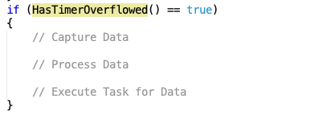

---

3. Special Behavior Actions can be taken based upon received over BLE from the RN4870 Module
    - Processing of PROTOCOL_PACKET_TYPES_t is a handled at the Application level.
    - Byte default only processing of 'L' & 'S' Commands are handled by the End-Device.
    - Additional Character Commands can be added to the PROTOCOL_PACKET_TYPES_t enum type.
    - Received BLE packets are processed within LIGHTBLUE_ParseIncomingPacket(char)
    - Actual Processing of Valid/Invalid Packets based on 'Type ID' is handled in LIGHTBLUE_PerformAction(char, uint8_t).
    - Processing of the Data is done upon completion of a 'Framed' Packet within the '{' or '}' Characters.

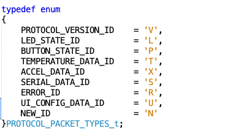

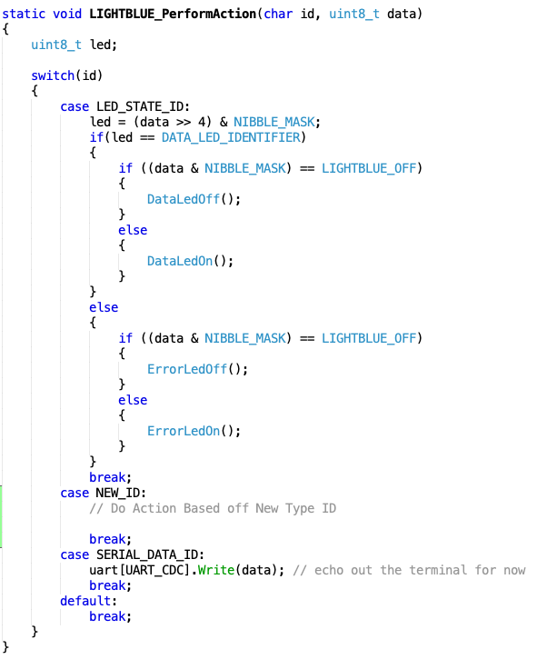

---

4. When CONNECTED, Unique Commands can be issued through the CDC Serial if USB is connected.
    - Can be used to request Pre-Emptive task through terminal
        * 'Finished' Command String stored in 'lightBlueSerial' buffer.
        * Perform a memcpy(destination, source) prior to the call to LIGHTBLUE_SendSerialData. 
        * Use lightBlueSerial as the source to capture un-manipulated data
    - Useful for Testing

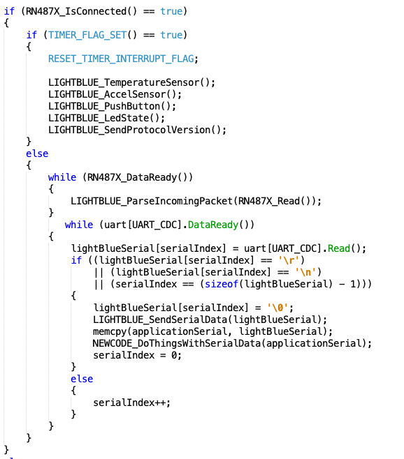

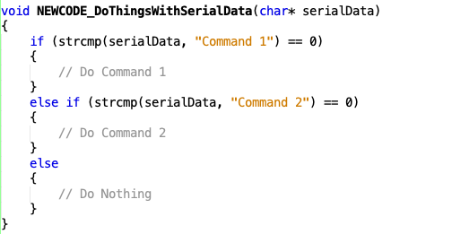

---

## Application Design
1. Peripheral and System Requirements configured via MCC.
2. Feature Library: RN2487X Driver Code
3. Library Usage: Foundation Services (I2C, SPI, EUSART, DELAY), Timer0
4. GPIO(s): (1) Push Button - SW0, (3) LEDs - DATA (Green, MCU controlled), ERR(Red, RN487X p2_2 controlled), BLE (Blue, RN487X)

## Application Architecture
### General Flowchart
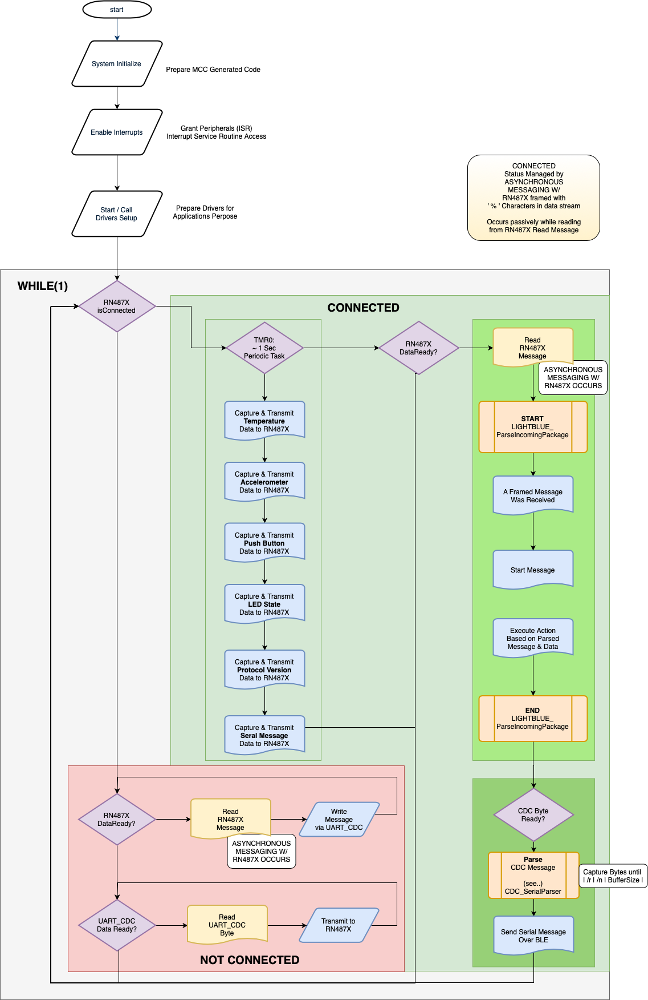

---

### BLE Message Parsing
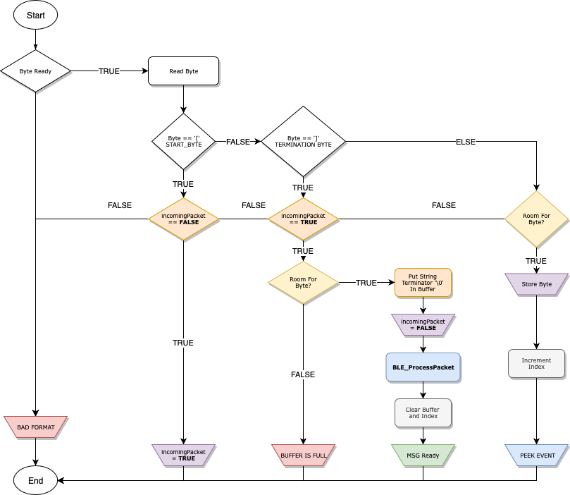

---

### BLE Message Processing
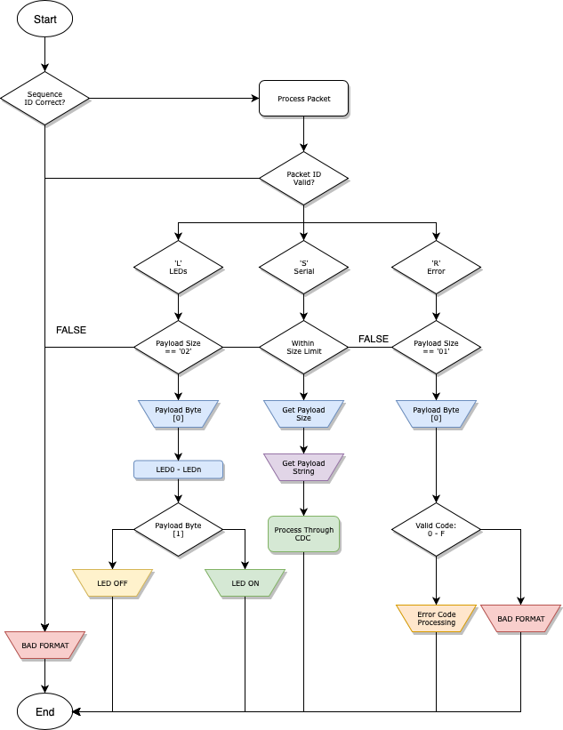

---

### CONNECTED Serial Message Parsing
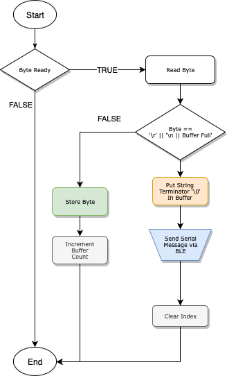

---

  ### Light Blue Explorer Use Cases
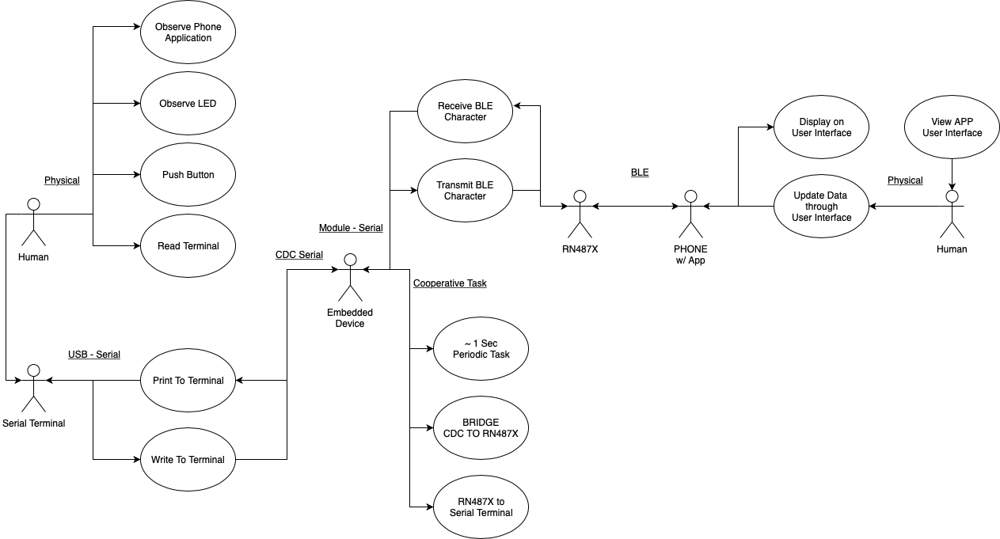

---

  ### General Code Execution Sequence
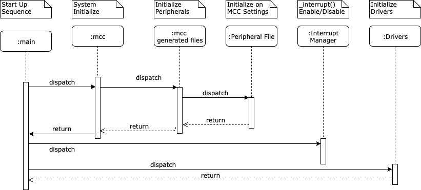

---

  ### Cooperative Code Loop Execution Sequence
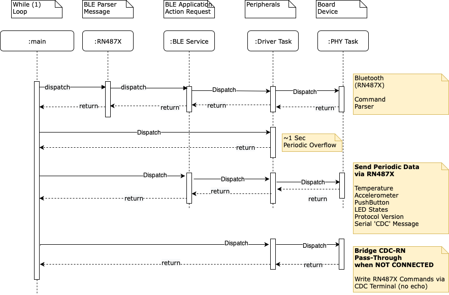

---

## Board Schematics
### Board Front Schematic
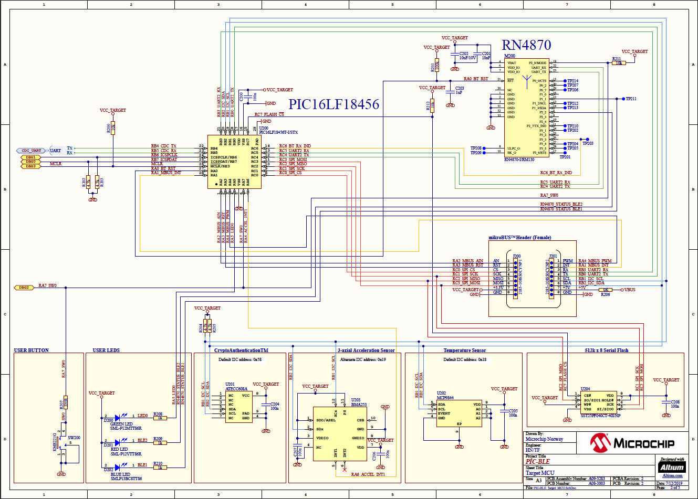

---

### Board Back Schematic
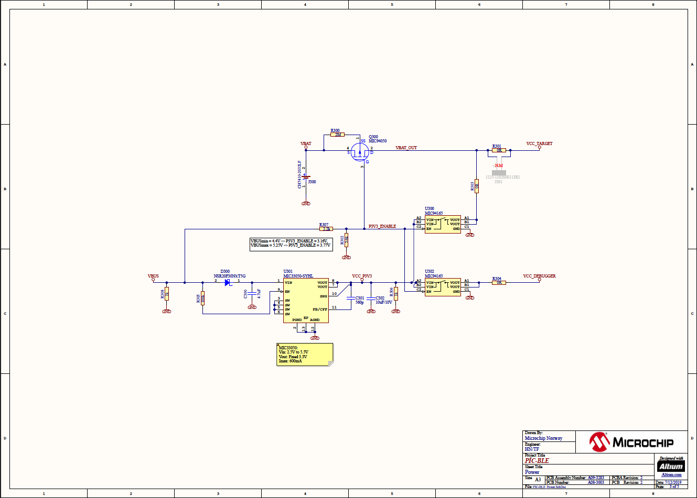

---

### Board Programmer Schematic
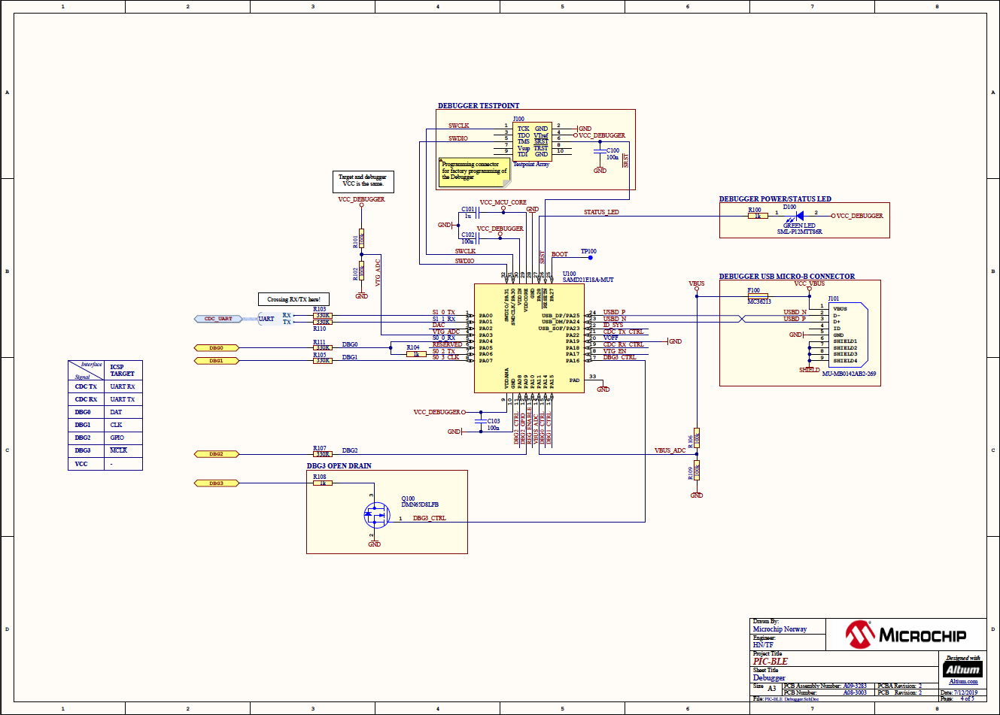

---

```